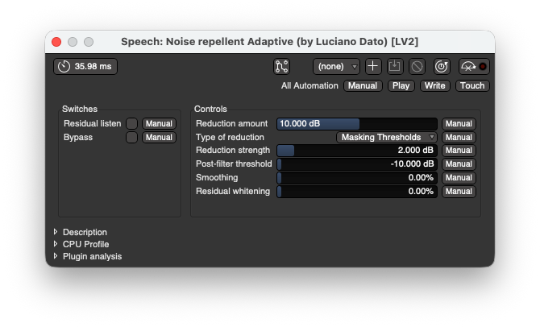
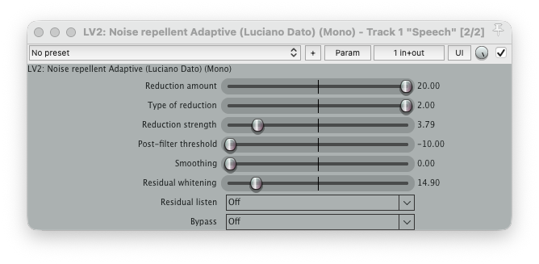

# Noise Repellent

A suite of LV2 plugins for real-time spectral noise reduction, built on the [libspecbleach](https://github.com/lucianodato/libspecbleach) library.

[](https://github.com/lucianodato/noise-repellent/actions/workflows/build.yml)

## Features

* **Manual capture noise reduction**: Typical noise reduction where you capture a noise profile.
* **Adaptive noise reduction**: Automatic noise suppression, optimized for voice (low latency).
* **Adjustable parameters**: Reduction amount, smoothing, whitening, and transient protection.
* **Residual listening**: Hear exactly what is being removed.
* **Soft bypass**: Cross-faded bypass to avoid clicks.
* **State saving**: Noise profiles are saved with your host session.

## Screenshots





## Installation

### From Binaries
Binaries for Linux, macOS, and Windows are provided in the [GitHub Releases](https://github.com/lucianodato/noise-repellent/releases) page. Extract the folder to your LV2 plugins directory:
- **Linux**: `~/.lv2/` or `/usr/lib/lv2/`
- **macOS**: `~/Library/Audio/Plug-Ins/LV2/` or `/Library/Audio/Plug-Ins/LV2/`
- **Windows**: `%COMMONPROGRAMFILES%\LV2\`

> [!IMPORTANT]
> **macOS Users**: Due to Gatekeeper security, you might need to remove the "quarantine" attribute after copying the plugin manually. If the plugin fails to load in your DAW, run one of the following commands in your terminal:
>
> **For User folder:**
> ```bash
> xattr -rd com.apple.quarantine ~/Library/Audio/Plug-Ins/LV2/nrepellent.lv2
> ```
> **For System folder:**
> ```bash
> sudo xattr -rd com.apple.quarantine /Library/Audio/Plug-Ins/LV2/nrepellent.lv2
> ```

### From Source

**Requirements:**
- Meson build system >= 0.60.0 & Ninja
- C Compiler (GCC/Clang)
- LV2 development headers
- `pkg-config`

**Build:**

```bash
git clone https://github.com/lucianodato/noise-repellent.git
cd noise-repellent

# Configure build
meson setup build --buildtype=release

# Compile
meson compile -C build

# Install (sudo may be required)
meson install -C build
```

**Build Options:**

You can configure the build options using `-Doption=value`:

- `custom_warning_level`: 0-3 (default: 2). Controls compiler warning verbosity.
- `treat_warnings_as_errors`: Treat compiler warnings as errors (default: false).
- `enable_sanitizers`: Enable sanitizers for debug builds (default: false).
- `sanitize_address`: Enable address sanitizer (only if enable_sanitizers is true) (default: true).
- `sanitize_undefined`: Enable undefined behavior sanitizer (only if enable_sanitizers is true) (default: true).
- `lv2dir`: Install directory for LV2 bundles (absolute path or relative to prefix) (default: '').
- `force_bundled_libspecbleach`: Force use of bundled libspecbleach instead of system version (default: false). Enable this to ensure API compatibility when building from source.
- `static_libspecbleach`: Link libspecbleach and its internal dependencies (like FFTW) statically into the plugins (default: true). This creates self-contained binaries that don't depend on external shared libraries. Set to `false` if you are a packager and prefer to use a shared system library.
- `libspecbleach_libdir`: Directory where libspecbleach is installed (used for RPATH when using system libspecbleach). Leave empty for automatic detection (pkg-config libdir, then Meson libdir). Useful when libspecbleach is installed to a non-standard location.

Example for a self-contained static build:
```bash
meson setup build --buildtype=release -Dstatic_libspecbleach=true -Dforce_bundled_libspecbleach=true
meson compile -C build
```

## Usage

Please refer to the [Project Wiki](https://github.com/lucianodato/noise-repellent/wiki) for detailed usage instructions.

## Contributing

Contributions are welcome! Please read [CONTRIBUTING.md](CONTRIBUTING.md) for details on our code of conduct and the process for submitting pull requests.

## License

This project is licensed under the LGPL-3.0 License - see the [LICENSE](LICENSE) file for details.
